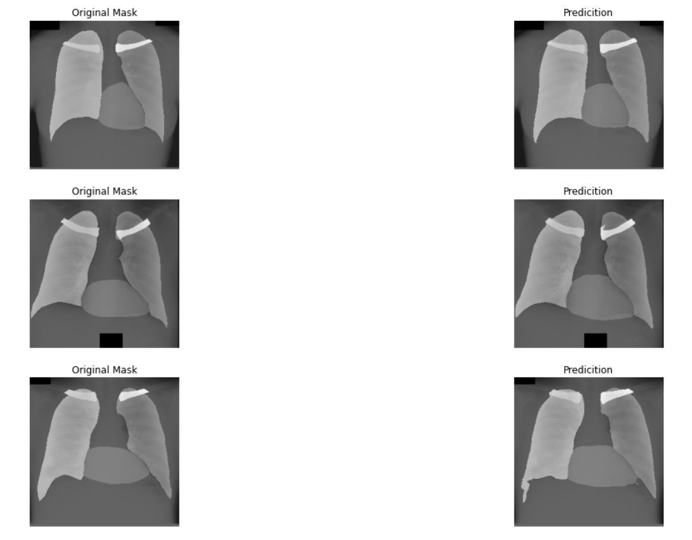

# JSRT Unet
## Instance Segmentation of Lungs and Heart in JSRT Dataset using UNET Model

This project implements an instance segmentation model using the UNET architecture to precisely identify and segment lungs and heart structures in medical images from the JSRT dataset. The goal is to provide accurate delineation of these organs, aiding in medical image analysis and diagnosis. The project includes code for training the model, evaluating results, and showcasing the effectiveness of the instance segmentation on the provided dataset.

### Table of Contents

- [Overview](#overview)
- [Prerequisites](#prerequisites)
- [Dataset](#dataset)
- [Installation](#installation)
- [Usage](#usage)
- [Results](#results)
- [Contributing](#contributing)
- [License](#license)
- [Acknowledgments](#acknowledgments)

---

## Overview

This project employs the UNET model to perform instance segmentation on lungs and heart structures in medical images from the JSRT dataset. By precisely delineating these organs, the model enhances the accuracy of medical image analysis, providing valuable insights for radiologists and healthcare professionals. The codebase is adaptable, facilitating integration into existing pipelines and serving as a resource for advancing medical image segmentation techniques.

## Prerequisites
- numpy>=1.21.2
- pandas>=1.3.3
- torch>=1.9.1
- torchvision>=0.10.1
- Pillow>=8.2.0
- opencv-python>=4.5.3.56
- matplotlib>=3.4.3
- tqdm>=4.62.2

## Dataset

This project utilizes the **JSRT (Japanese Society of Radiological Technology) Dataset** for training and evaluation.
### Dataset Details:

- **Name:** JSRT Dataset
- **Description:** The dataset consists of chest radiographs with annotations for lungs and other structures. It is widely used in the medical imaging community for algorithm development and evaluation.


## Installation
```bash
# Example installation steps
git clone https://github.com/anirudh6415/JSRT_Unet.git
cd JSRT_Unet
pip install -r requirements.txt
#Understand the working of Jupiter notebook
```

## Results

<div>
  
  
</div>


License
# MIT License

[JSRT_Unet]

Permission is hereby granted, free of charge, to any person obtaining a copy of this software and associated documentation files (the "Software"), to deal in the Software without restriction. This includes the rights to use, copy, modify, merge, publish, distribute, sublicense, and/or sell copies of the Software, subject to the following conditions:
The above copyright notice and this permission notice shall be included in all copies or substantial portions of the Software.
THE SOFTWARE IS PROVIDED "AS IS", WITHOUT WARRANTY OF ANY KIND.

Acknowledgments
Thanks to many resources from the internet.

